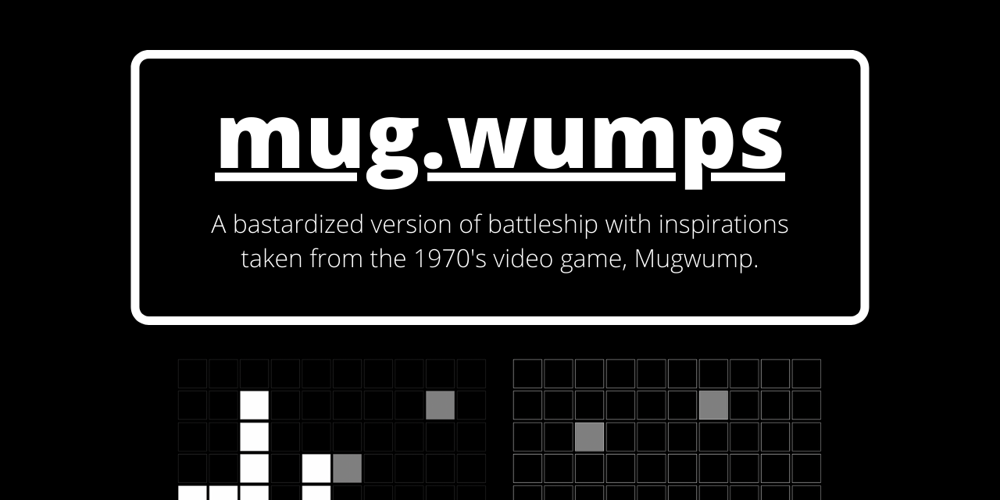

A bastardized version of [battleship](https://en.wikipedia.org/wiki/Battleship_(game)) with inspirations taken from the 1970's video game, [Mugwump](https://en.wikipedia.org/wiki/Mugwump_(video_game)), that is playable on any web-browser of choice. Made in partial completion of [The Odin Project's Full Stack JavaScript Path](https://www.theodinproject.com/paths/full-stack-javascript).

## Installation
[A live deployment of `mug-wumps` is available online.](https://francislangit.github.io/mug-wumps/) However, for those that would like to locally access the repository:

1. Clone the repository with `git clone https://github.com/FrancisLangit/mug-wumps/`, or download it as a `.zip` file.
2. Navigate to where the repository is saved on your local machine.
3. Run `npm install` to install the application's dependencies.
4. Open up `dist/index.html` on your web-browser of choice.

## How To Play

To start the game, press the *Start* button. You'll then have a turn to make a find on a *wump*. If you find one, the square you clicked  on turns red. If otherwise, it turns green. The computer is then subsequently given the same opportunity.

The game loop will over and over again and, in order to win, you must find all of the computer's *wumps* before it finds yours. 

Additionally, before starting the match, you'll have unlimited opportunities to randomize the placement of the *wumps* in your gameboard. Press the *Randomize* button before the game starts to do so.

## Contributing

Feel free to submit an issue if you find a bug. You're also welcome to forward a pull request if you want to introduce a change.

## License

[MIT License](https://github.com/FrancisLangit/mug-wumps/blob/main/LICENSE)
